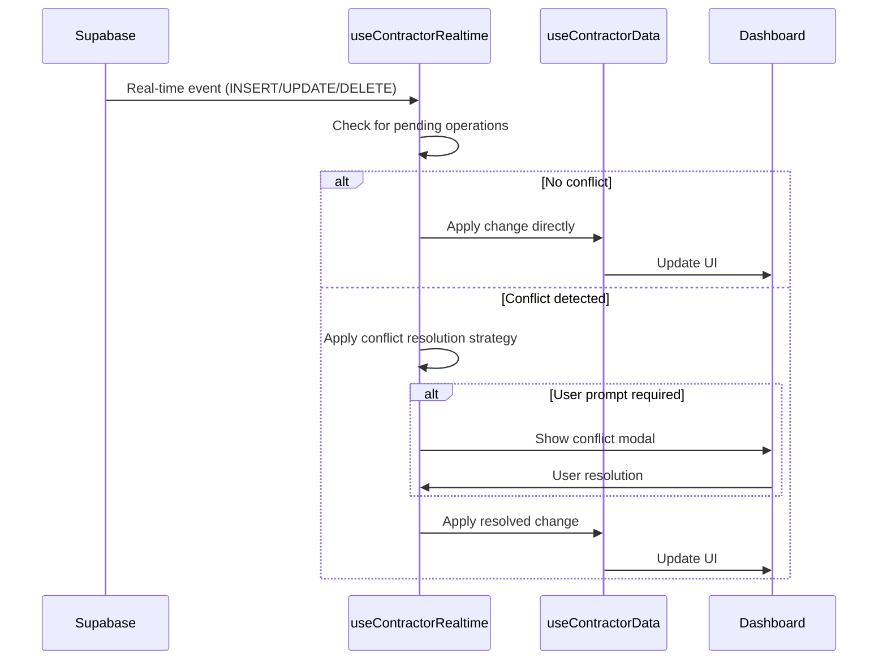
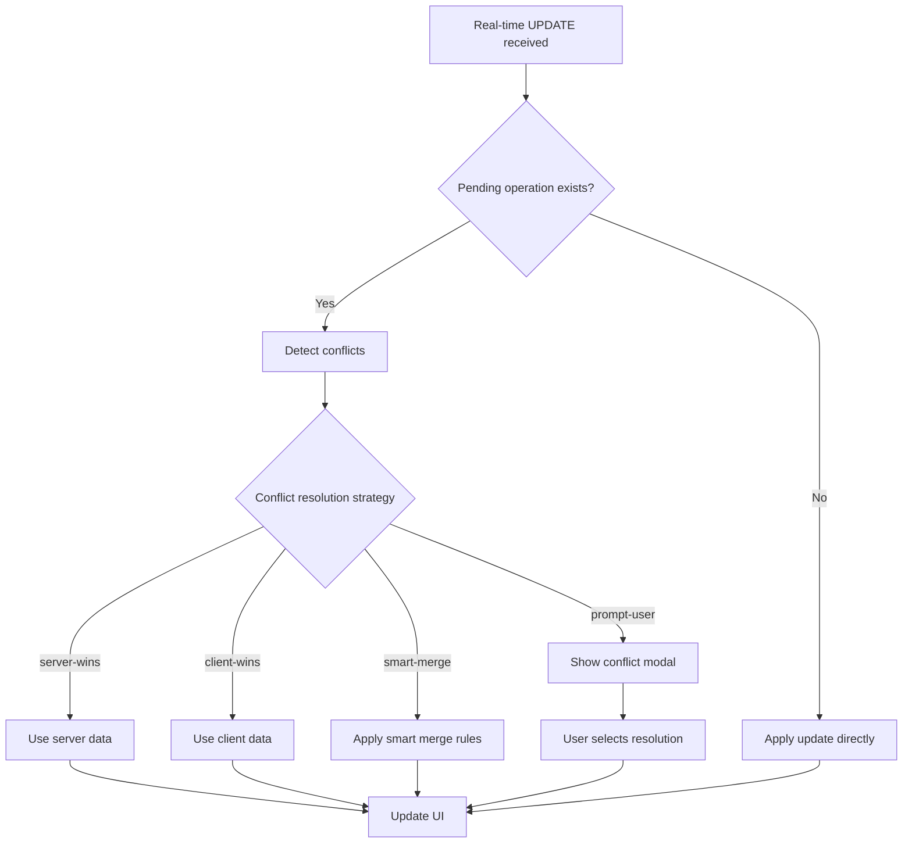

# Real-time Data Updates Implementation

## Overview

This document describes the comprehensive real-time data updates implementation for the contractor tracker system. The implementation provides Supabase real-time subscriptions, automatic UI updates, and sophisticated conflict resolution for concurrent edits.

## Requirements Addressed

- **Requirement 1.4**: Real-time contractor data access
- **Requirement 6.4**: Conflict resolution for concurrent edits

## Architecture

### Core Components

```
Real-time System Architecture
├── useContractorRealtime Hook (Real-time subscriptions)
├── ContractorConflictResolver (Conflict resolution strategies)
├── RealtimeStatusIndicator (Connection status display)
├── ConflictResolutionModal (User conflict resolution)
└── Enhanced useContractorData Hook (Integration layer)
```

## Implementation Details

### 1. Real-time Subscriptions (`useContractorRealtime`)

**Location**: `src/hooks/useContractorRealtime.ts`

**Features**:
- Supabase real-time channel subscriptions
- INSERT, UPDATE, DELETE event handling
- Automatic reconnection with exponential backoff
- Pending operation tracking for conflict detection
- Connection status monitoring
- Error handling and recovery

**Usage**:
```typescript
const realtime = useContractorRealtime({
  enabled: true,
  conflictResolution: {
    strategy: 'server-wins',
    onConflict: customConflictHandler
  },
  onInsert: (contractor) => console.log('New contractor:', contractor),
  onUpdate: (contractor, old) => console.log('Updated:', contractor),
  onDelete: (id) => console.log('Deleted:', id),
  onError: (error) => console.error('Real-time error:', error),
  onConnectionChange: (connected) => console.log('Connected:', connected)
});
```

**Key Methods**:
- `registerPendingOperation(contractor)` - Track pending changes for conflict detection
- `clearPendingOperation(contractorId)` - Clear pending operation
- `reconnect()` - Manually reconnect subscription
- `disconnect()` - Disconnect subscription
- `getSubscriptionStats()` - Get connection statistics

### 2. Conflict Resolution (`ContractorConflictResolver`)

**Location**: `src/utils/contractor-conflict-resolver.ts`

**Strategies**:

#### Server-Wins Strategy
Always uses server data, discarding client changes.
```typescript
const result = ContractorConflictResolver.resolveServerWins(serverData, clientData);
```

#### Client-Wins Strategy
Uses client data while preserving server metadata.
```typescript
const result = ContractorConflictResolver.resolveClientWins(serverData, clientData);
```

#### Smart Merge Strategy
Intelligently merges data based on field importance:
- Critical fields (status, contract_type): Server wins
- Financial fields: Client wins if different
- Text fields: Longer/more detailed version wins
- Dates: More reasonable date wins

```typescript
const result = ContractorConflictResolver.resolveSmartMerge(serverData, clientData);
```

#### Field Priority Strategy
Resolves based on configurable field priorities:
```typescript
const priorities = {
  contractor_name: 'client',
  status: 'server',
  notes: 'merge'
};
const result = ContractorConflictResolver.resolveFieldPriority(
  serverData, 
  clientData, 
  priorities
);
```

#### Interactive Strategy
Prepares data for user decision:
```typescript
const result = ContractorConflictResolver.prepareInteractiveResolution(
  serverData, 
  clientData
);
```

**Validation**:
```typescript
const validation = ContractorConflictResolver.validateResolution(resolvedContractor);
if (!validation.isValid) {
  console.error('Validation errors:', validation.errors);
}
```

### 3. Real-time Status Indicator (`RealtimeStatusIndicator`)

**Location**: `src/components/contractor/RealtimeStatusIndicator.tsx`

**Features**:
- Visual connection status (Connected, Connecting, Error, Disconnected)
- Event count display
- Retry functionality
- Detailed view with connection attempts and error information
- Responsive design with compact and detailed modes

**Usage**:
```typescript
<RealtimeStatusIndicator
  isConnected={realtime.isConnected}
  isConnecting={realtime.isConnecting}
  error={realtime.error}
  eventCount={realtime.eventCount}
  connectionAttempts={realtime.connectionAttempts}
  maxRetries={realtime.maxRetries}
  canRetry={realtime.canRetry}
  onReconnect={realtime.reconnect}
  showDetails={true}
/>
```

### 4. Conflict Resolution Modal (`ConflictResolutionModal`)

**Location**: `src/components/contractor/ConflictResolutionModal.tsx`

**Features**:
- Interactive conflict resolution interface
- Strategy selection (Server, Client, Manual)
- Field-by-field conflict display
- Manual resolution with field selection
- Timestamp comparison
- Validation and error handling

**Usage**:
```typescript
<ConflictResolutionModal
  isOpen={hasConflict}
  onClose={cancelConflictResolution}
  serverData={conflictData.serverData}
  clientData={conflictData.clientData}
  conflicts={detectedConflicts}
  onResolve={(resolvedContractor, strategy) => {
    console.log('Resolved with strategy:', strategy);
    resolveConflict(resolvedContractor);
  }}
  onCancel={cancelConflictResolution}
/>
```

### 5. Enhanced Data Hook Integration

**Location**: `hooks/useContractorData.ts`

**New Options**:
```typescript
const contractorData = useContractorData({
  enableRealtime: true,
  conflictResolution: 'prompt-user', // 'server-wins' | 'client-wins' | 'smart-merge' | 'prompt-user'
  onConflict: customConflictHandler
});
```

**New Return Values**:
```typescript
const {
  // Real-time functionality
  realtime: {
    isConnected,
    isConnecting,
    error,
    lastEvent,
    eventCount,
    reconnect,
    disconnect,
    getStats
  },
  
  // Conflict resolution
  conflictData,
  hasConflict,
  resolveConflict,
  cancelConflictResolution,
  
  // Status helpers
  isRealtimeEnabled,
  isRealtimeConnected,
  shouldShowRealtimeStatus,
  realtimeEventCount
} = contractorData;
```

## Event Flow

### 1. Real-time Event Reception



### 2. Conflict Resolution Flow



## Configuration

### Environment Variables

```env
VITE_SUPABASE_URL=https://your-project.supabase.co
VITE_SUPABASE_ANON_KEY=your-anon-key
```

### Supabase Setup

1. **Enable Real-time**: Ensure real-time is enabled for the `contractor_tracker` table
2. **Row Level Security**: Configure appropriate RLS policies
3. **Permissions**: Ensure the anon key has necessary permissions

### Dashboard Integration

```typescript
// In ContractorTrackerDashboard.tsx
const contractorData = useContractorData({
  enableRealtime: true,
  conflictResolution: 'prompt-user'
});

// Add status indicator to header
{shouldShowRealtimeStatus && (
  <RealtimeStatusIndicator
    isConnected={realtime.isConnected}
    isConnecting={realtime.isConnecting}
    error={realtime.error}
    eventCount={realtime.eventCount}
    connectionAttempts={realtime.connectionAttempts}
    maxRetries={realtime.maxRetries}
    canRetry={realtime.canRetry}
    onReconnect={realtime.reconnect}
  />
)}

// Add conflict resolution modal
{hasConflict && conflictData && (
  <ConflictResolutionModal
    isOpen={hasConflict}
    onClose={cancelConflictResolution}
    serverData={conflictData.serverData}
    clientData={conflictData.clientData}
    conflicts={[]}
    onResolve={resolveConflict}
    onCancel={cancelConflictResolution}
  />
)}
```

## Testing

### Unit Tests

**Location**: `src/tests/contractor-realtime.test.tsx`

**Coverage**:
- Real-time hook functionality
- Conflict resolution strategies
- Status indicator component
- Conflict resolution modal
- Integration scenarios

**Run Tests**:
```bash
npm run test src/tests/contractor-realtime.test.tsx
```

### Manual Testing Scenarios

1. **Basic Real-time Updates**:
   - Open dashboard in two browser tabs
   - Add/edit/delete contractor in one tab
   - Verify updates appear in other tab

2. **Conflict Resolution**:
   - Edit same contractor in two tabs simultaneously
   - Save changes in both tabs
   - Verify conflict resolution modal appears
   - Test different resolution strategies

3. **Connection Handling**:
   - Disconnect network
   - Verify status indicator shows disconnected
   - Reconnect network
   - Verify automatic reconnection

4. **Error Scenarios**:
   - Invalid Supabase credentials
   - Network timeouts
   - Server errors
   - Verify error handling and recovery

## Performance Considerations

### Optimization Strategies

1. **Event Throttling**: Prevent excessive UI updates
2. **Selective Updates**: Only update affected components
3. **Conflict Batching**: Group related conflicts
4. **Connection Pooling**: Reuse connections efficiently

### Memory Management

1. **Subscription Cleanup**: Automatic cleanup on unmount
2. **Pending Operation Timeout**: Auto-clear after 30 seconds
3. **Event History Limits**: Limit stored event history

## Security Considerations

### Data Protection

1. **Authentication**: Proper Supabase authentication
2. **Authorization**: Row-level security policies
3. **Input Validation**: Validate all real-time data
4. **Error Sanitization**: Don't expose sensitive errors

### Conflict Resolution Security

1. **Data Validation**: Validate resolved data
2. **Permission Checks**: Ensure user can modify data
3. **Audit Logging**: Log conflict resolutions
4. **Rate Limiting**: Prevent abuse

## Troubleshooting

### Common Issues

1. **Connection Failures**:
   - Check Supabase URL and key
   - Verify network connectivity
   - Check browser console for errors

2. **Events Not Received**:
   - Verify real-time is enabled in Supabase
   - Check table permissions
   - Verify subscription setup

3. **Conflicts Not Detected**:
   - Check pending operation registration
   - Verify conflict detection logic
   - Check timestamp comparison

4. **UI Not Updating**:
   - Verify event handlers are called
   - Check React state updates
   - Verify component re-rendering

### Debug Tools

1. **Console Logging**: Extensive logging throughout
2. **Connection Stats**: Real-time connection statistics
3. **Event History**: Track received events
4. **Conflict Details**: Detailed conflict information

## Future Enhancements

### Planned Features

1. **Optimistic Updates**: Apply changes immediately, rollback on conflict
2. **Collaborative Editing**: Real-time collaborative editing interface
3. **Change History**: Track and display change history
4. **Advanced Conflict Resolution**: AI-powered conflict resolution
5. **Performance Monitoring**: Real-time performance metrics
6. **Offline Sync**: Enhanced offline synchronization

### Scalability Improvements

1. **Event Filtering**: Server-side event filtering
2. **Batch Operations**: Batch multiple operations
3. **Connection Multiplexing**: Share connections across components
4. **Caching Strategies**: Advanced caching for real-time data

## Conclusion

The real-time data updates implementation provides a robust, scalable solution for live data synchronization with comprehensive conflict resolution. The system handles network interruptions gracefully, provides clear user feedback, and maintains data consistency across concurrent users.

Key benefits:
- ✅ Automatic UI updates for all data changes
- ✅ Multiple conflict resolution strategies
- ✅ User-friendly conflict resolution interface
- ✅ Robust error handling and recovery
- ✅ Comprehensive testing coverage
- ✅ Performance optimized
- ✅ Security conscious
- ✅ Fully documented and maintainable